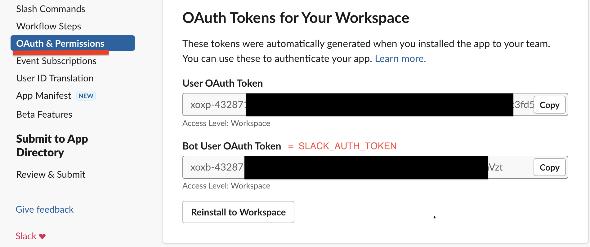
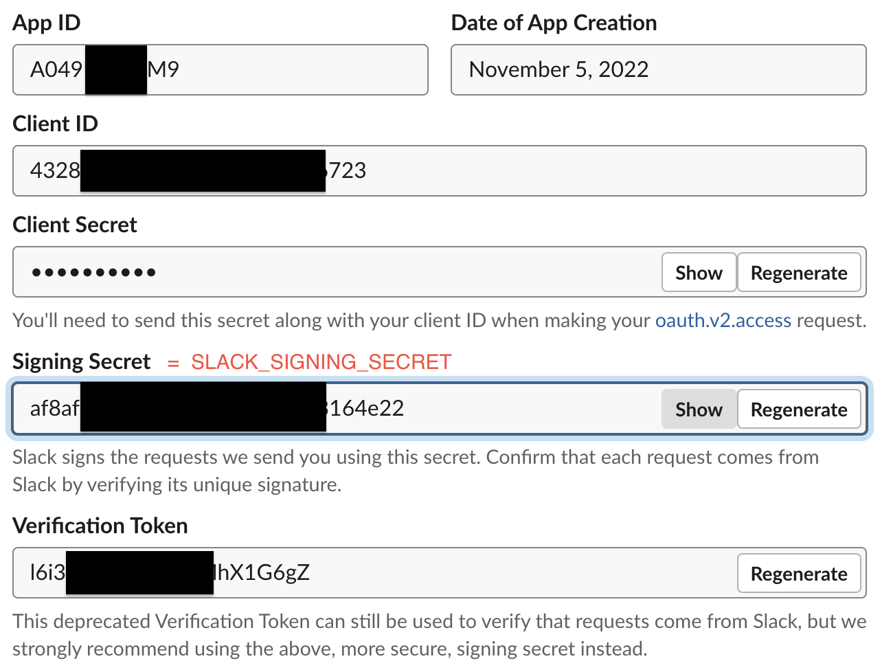

# Review Mate Picker

Como adicionar um app a um channel?
- cria o app em https://api.slack.com/apps
- configura a url do bot em Enable Events -> https://<bot_url>/events
- Add Bot User Event e Add Workspace Event -> link_shared
- App unfurl domains -> github.com
- convida o app para o channel

- Scopes:
- Bot Token Scopes:
  - channels:history
  - chat:write
  - links:read
  - users:read
- User Token Scopes:
  - links:read

- Variáveis de ambiente:

