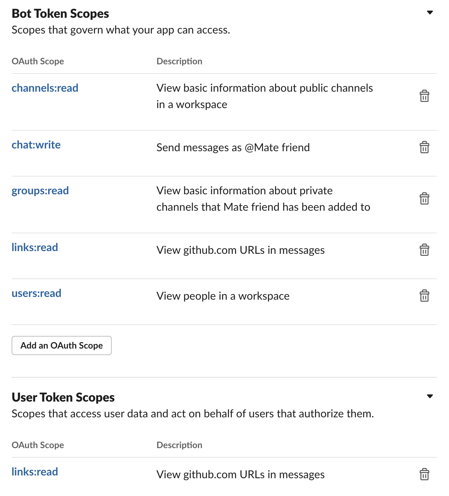

# Review Mate Picker

Como adicionar um app a um channel?
- cria o app em https://api.slack.com/apps
- configura a url do bot em Enable Events -> https://<bot_url>/events
- Add Bot User Event e Add Workspace Event -> link_shared
- App unfurl domains -> github.com
- convida o app para o channel

- Scopes:

- Variáveis de ambiente:

